<!-- Project Title -->
<h1 align="center" id="title">IDEA: A Powerful Flutter Notes App</h1>

<!-- Project Description -->

Elevate your note-taking experience with IDEA, an intuitive Flutter notes app. Capture your thoughts, create to-do lists, and manage your ideas effortlessly. With a user-friendly interface and a wide range of features, IDEA is designed to streamline your note management process.

<!-- Project Screenshots -->
<h2 align="center">Project Screenshots</h2>

   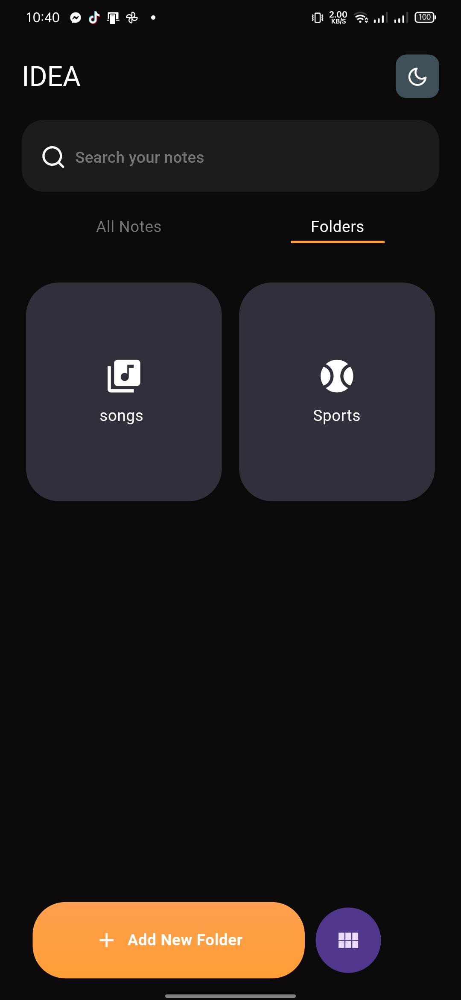
    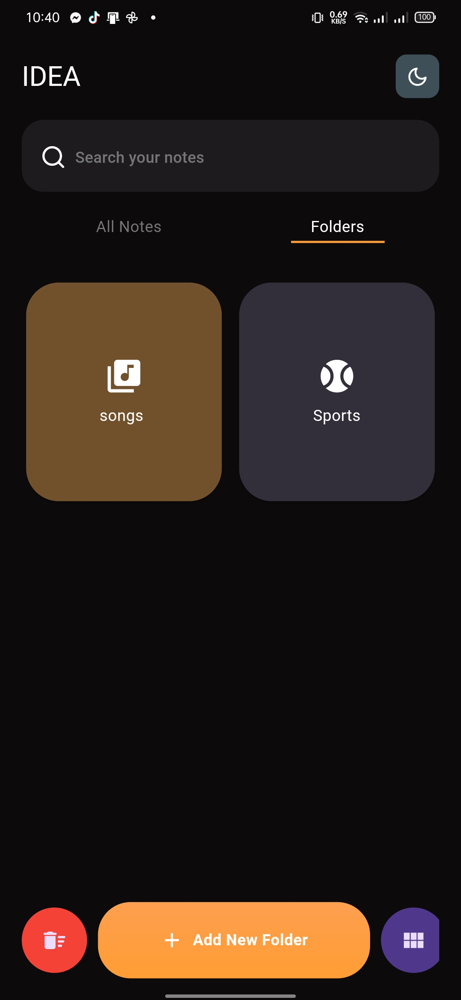
    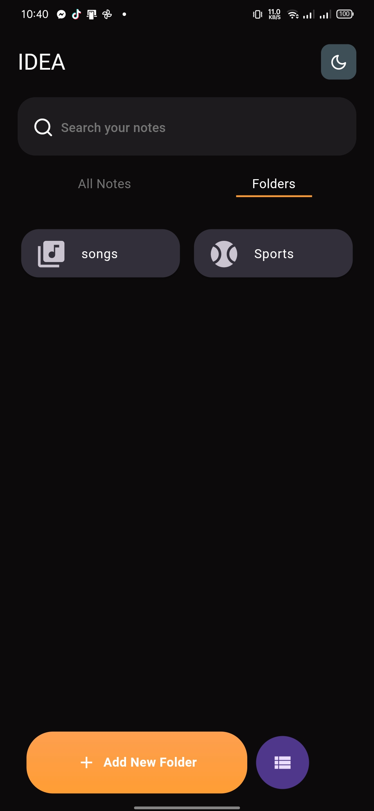
    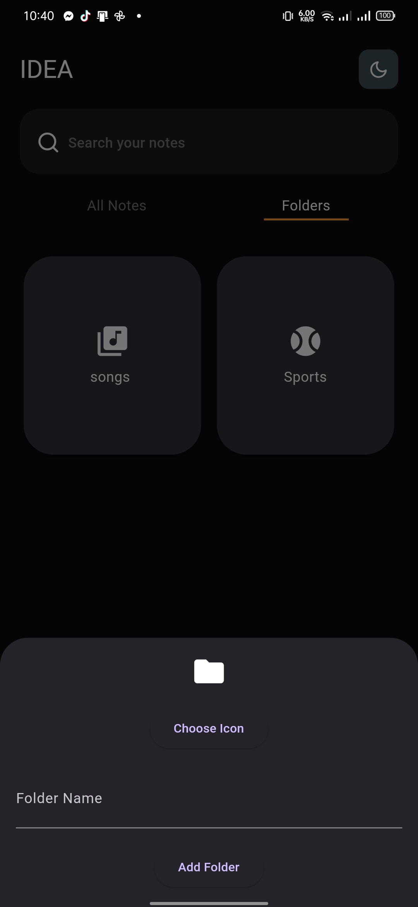
    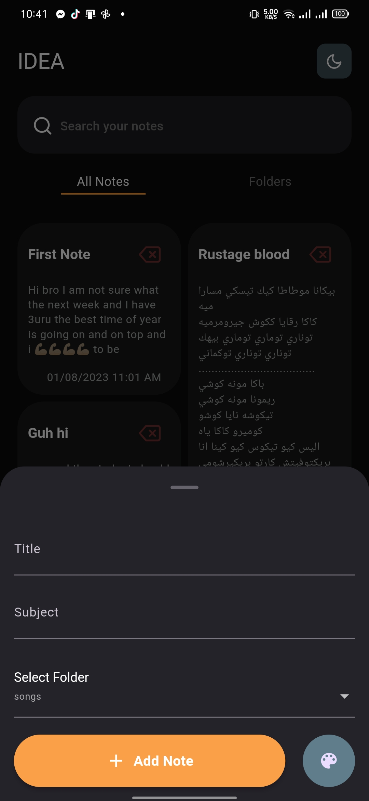
    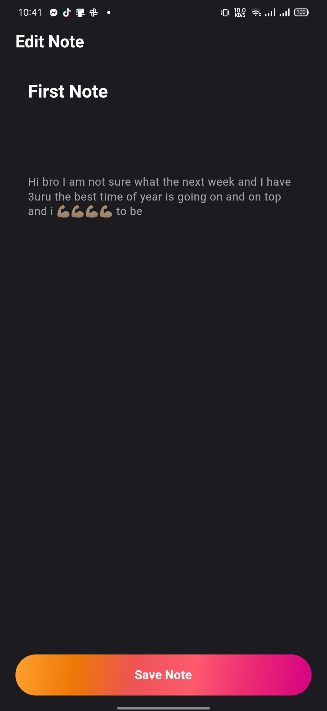
    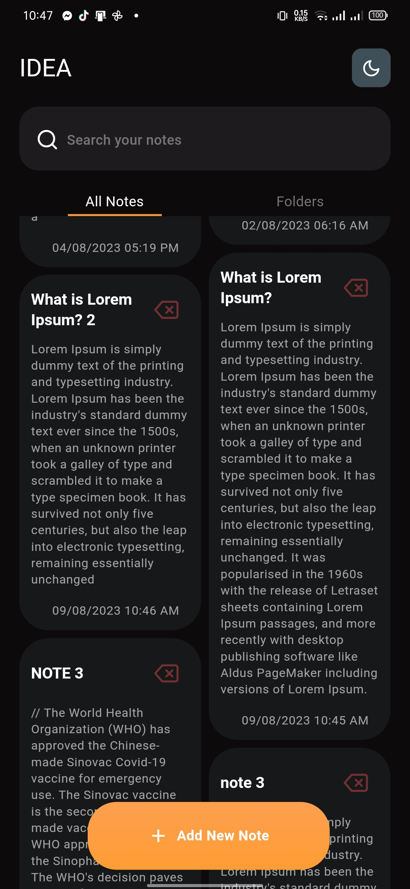
    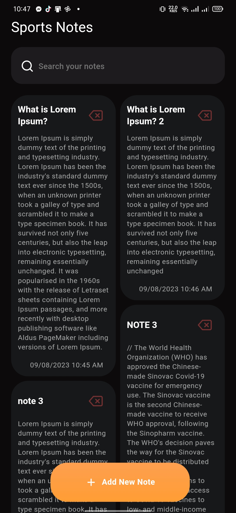
    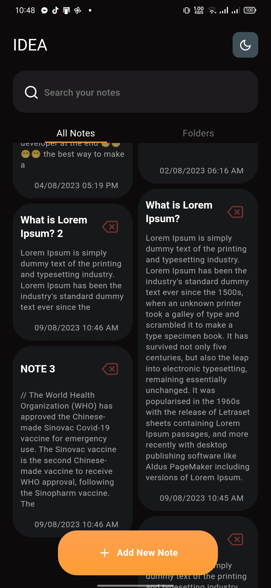
    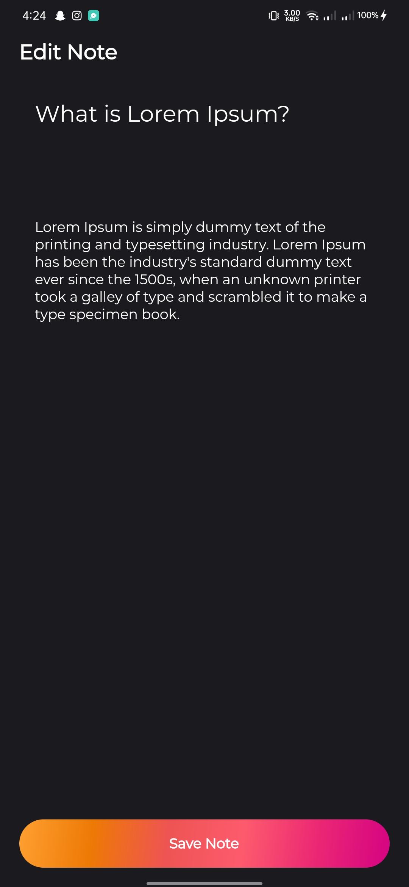
    
    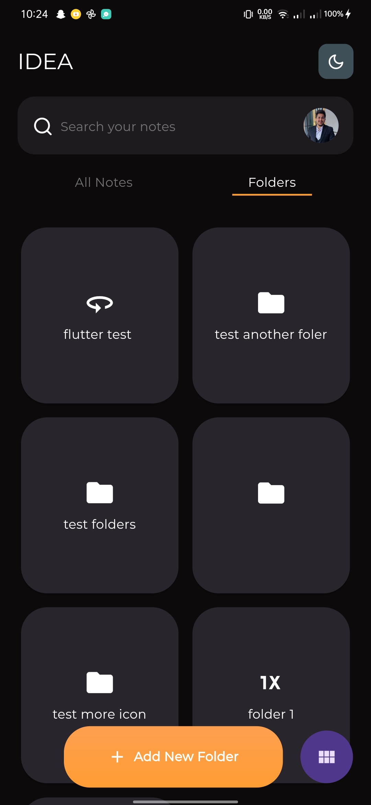
    
  <!-- Add more screenshots... -->

<!-- Features -->
<h2 align="center">🚀 Features</h2>

Discover the exceptional features that set IDEA apart:

<ul>
  <li>Dark & Night Modes: Seamlessly switch between eye-friendly dark and night modes.</li>
  <li>Effortless Note Management: Create, edit, read, and delete notes with ease.</li>
  <li>Organize with Folders: Categorize notes with folders for structured organization.</li>
  <li>Nested Folders: Create personalized organizational systems with folders within folders.</li>
  <li>Search: Easily locate notes using the efficient search functionality.</li>
  <li>Hive Local Storage: Store notes efficiently using the Hive local database.</li>
  <li>BloC State Management: Utilize Bloc for streamlined state management.</li>
</ul>

<!-- Technologies Used -->
<h2 align="center">💡 Technologies Used</h2>

Built using cutting-edge technologies:

<ul>
  <li>Dart & Flutter</li>
  <li>Hive Local Database</li>
  <li>BloC State Management</li>
  <!-- Add more technologies... -->
</ul>
